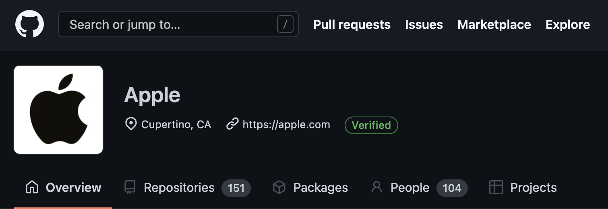

# NLP-Github-Project

Here we will use natural language processing in order to predict coding language of a Github repository based on the text of the README.md file.

---

## Authors

- [@joannbalraj](https://github.com/joann-balraj)
- [@jaredgodar](https://github.com/Jared-Godar)
- [@davidrodriguez](https://github.com/david-rodriguez-siller)
- [@brentschriver](https://github.com/brentschriver)

---

## About the Project

Categorizing things based on a written descripion is often trivial for humans, but was all but impossible for computers until fairly recently. Automation of this process vastly improves throughput saving human cognitive time for other tasks or allowing categorization of larger datasets.

Here, we are using NLP techniques to predict the coding language of a Github repository based on the text of that repository's README.md file.

---

## Project Goals

Accurately predict the coding language of a Github repository based on the text of that repository's README.md.

**DELIVERABLES:**

- [x] A well-documented [Jupyter notebook](https://github.com/NLP-Github-Project-Hopper5/NLP-Github-Project/blob/main/final_notebbok.ipynb) that contains a report of your analysis, and link to that notebook.
- [x] A [slideshow](https://docs.google.com/presentation/d/1M8jFSjrK3vIE0XS-CTOQJWhhJRG26yVwSvqaWec_C1U/edit?usp=sharing) suitable for a general audience that summarizes your findings.
- Include well-labeled visualizations in your slides.
- [x] Link to the [team Trello board.](https://trello.com/b/dChAeebt/nlp-project)
- [ ] A 5-minute presentation. Each team member should present a portion of the presentation.

---

## Initial Questions

1. What programming languages are represented in our dataset?
2. How balanced is the dataset in terms of languages represented?
3. Are there words uniquely tied to specific languages?
   1. What are the most useful words to predict language?
   2. How frequently are they uses in other langages?
4. What types of models are most accurate?
   1. Underlying Data: Bag of Words, vs. scored words?
   2. Assess various classification algorithms.

---

## Initial Hypotheses

1. There will be language-specific words overrepresented in subsets of languages
   1. Perhaps the language name will appear more in the `README`.
   2. There will likely be language-specific functional words of high predictive value
2. Bigrams and higher order n-grams could be good modeling features.
3. We will probably have to custom, coding-specific stopwords that are not part of a default natural language list, but will appear in all of the `README`s and be of low value. (i.e, code, data, etc.)

---

## Data Dictionary

| Feature                 | Datatype                         | Definition                                                 |
|:------------------------|:---------------------------------|:-----------------------------------------------------------|
| language                | 146 non-null: object             | The predominant programming language used in the repository|
| original/readme_contents| 147 non-null: object             | Original readme content of the scraped repository          |
| target                  | 147 non-null: object             | Target variable modified to include the most common languages and lumping less occurring languages into category 'other'.  
| clean                   | 147 non-null: object             | The cleaned version of the readme                          |
| stemmed                 | 147 non-null: object             | The cleaned, stemmed version of the readme                 |
| lemmatized              | 147 non-null: object             | The cleaned, lemmatized version of the readme              |
| repo                    | 147 non-null: object             | The name of the scraped repository                         |

---

## Steps to Reproduce

- [x] Read the `README.md`.
- [ ] Clone this repository to your local environment.
- [ ] Open the `requirements.txt` to confirm you have the required libraries installed.
- [ ] Ensure your `.gitignore` file contains `env.py`.
- [ ] Ensure you have an `env.py` file with your Github API token and Github username if you are going to attempt to run any of the `acquire.py` files. (A cached `data.json` file is available should you want to just load it and get going.)
- [ ] Run final report notebook.

---

## Plan

1. **Acquire Data**
   1. Use beautiful soup to scrape a list of repository links from the Apple Github.
   2. Pass this list to the acquire.py function in order to build a JSON object containing the repository name, README text, and identified programing language.
2. **Prepare Data** Use the NLTK to:
   1. Convert text to lower case.
   2. Remove any accented, non-ASCII characters.
   3. Remove any special characters.
   4. Lemmatize words.
   5. Remove stopwords
   6. Produce a dataframe with the original and cleaned text.
   7. Split data:
      1. Train, validate, test.
      2. Separate x/y features / target (language).
3. **Explore**
   1. Look at the languages represented.
   2. Determine how many categories to have (including an `other` category for infrequently used langages).
   3. Separate the overall corpus into word lists for each language class.
   4. Look at the frequency of words in each list to determine unique words or words with high predictive value.
   5. Visualize most frequent words by language.
      1. Proportions by language for common words
      2. Word Clouds
   6. Examine bigrams and other n-grams.
4. **Model:**
   1. Feature enginnering
      1. Determine Term Frequency(TF).
      2. Determine Inverse Document Frequency(IDF).
      3. Calculate the TF-IDF index.
   2. Build models
      1. Logistic regression
      2. Decision trees
      3. Random Forest
      4. KNN
   3. Tune models
      1. Use the train and validate datasets to check for overtraining.
      2. Perform k-fold cross-validation.
   4. Evaluate models
      1. Determine the most important evaluation metric.
      2. Compare confusion matrices of different models to see which performs best.
      3. Test the best model on out of sample data.
5. **Delivery**
   1. Refine best visuals.
   2. Create slides.
   3. Divide presentation.
   4. Rehearse.
   5. Deliver

---

## Key Findings

- Our best performing model (without overfitting) was KNN with a K of 4.
- This model was 77% accurate on the out of sample data representing a 63% improvement from baseline.
- Many of these models are prone to overfitting
  - This is likely a function of our relatively small number of READMEs (147).

---

## Conclusions

- We were able to successfully deploy a NLP model that improved classification 63%.
- Our number of READMEs is probably lower than optimal - revisiting this approach with more files would likely increase performance.

---

## Future Directions

- We could potentially look for a similar company's repository to increase the number of README files.
- ome of the models that were overfit may prove useful or better than our current best performing model with continued hyperparameter tuning.
- There was an imbalance in the categories in training (47%/26%/16%/11%)
  - Some type of oversampeling technique may be helpful in improving models
- We should look at the misclassified items in out final test and see what the actual language is in order to see if any of the 'other' langues are disproportionately responsible for mismatches.

---

# Thank you for your time and attention